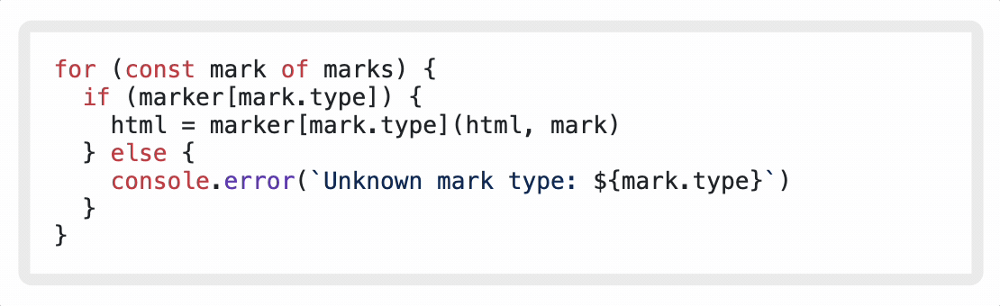
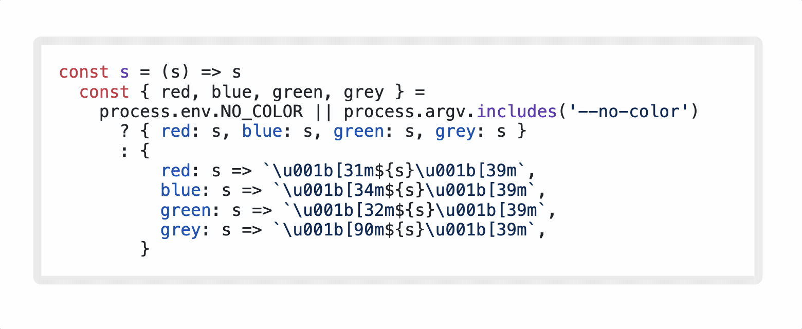

<h1 align="center"><code>code-markers</code> 🖌️</h1>

<p align="center">
  Text and line markers for code blocks.<br>
  <a href="https://www.npmjs.com/package/code-markers"><strong><code>code-markers</code> on npmjs.org »</strong></a><br>
  <br>
  Contents:
  <a href="#what-is-this">What?</a>
  •
  <a href="#install">Install</a>
  •
  <a href="#usage">Usage</a>
  •
  <a href="#todo">Todo</a>
  •
  <a href="#related">Related</a>
  •
  <a href="#🤠">🤠</a>
</p>



## What is this?

"After-the-fact" text markers for code blocks.  
Your code is already highlighted (like with hljs), add some markers to it. Demonstrate changes, add emphasis, etc.  
This won't add syntax highlighting, but it will add some extra information to your code blocks.  
No Shadow DOM required. Bring your own styles.

## Install

Depends. If you just want the custom HTML element, get the `./dist/code-markers-elem.js` file to the browser and you can use the `<code-markers>` element.

This may be easiest by `npm` installing and relying on a bundler to build the file into your project. Node.js usage is the same:

```sh
npm install code-markers
```

## Usage

### How do I use it?

Two ways: a custom HTML element and a JS function.

### `<code-markers>` custom HTML element

In the browser, markup some code blocks by wrapping them in a `<code-markers>` element.

```html
<code-markers mark="{1-10,12,red}" ins="'blue'" del="/green|grey/">
  <pre><code class="language-js hljs">
    <span class="hljs-keyword">...</span></code></pre>
</code-markers>
```

Running the demo provides a good example:

1. clone this repo
2. `npm install`
3. `npm run demo`
4. open `localhost:8000/demo.html` in your browser

#### Attributes

- `mark` - vanilla `<mark>` element wrapping and `.mark` class (for lines)
- `ins` - `<mark class="ins">` and `.ins` class (for lines)
- `del` - `<mark class="del">` and `.del` class (for lines)

#### Values

Search and mark:

- string like `"foo"` or `"'bar'"`
- regex like `"/foo/"` (always global)

Mark lines:

- number like `"42"`
- range like `"5-9"`

Sets of values:

- braces with commas (spaces optional) like `"{1,5-9 ,foo, 'bar',/baz/}"`

#### `element.markCode()`

If the `pre > code` block is already highlighted and the `<code>` element already has the `hljs` class, code marks will automatically be added. This is recommended as it's the fastest and most reliable.

Otherwise, you can call the `markCode()` method on the `<code-markers>` element to mark the code after highlighting is applied. Further, you don't have to have highlighting! Marks can be applied to any `pre > code` block.

```html
<script>
  hljs.highlightAll()

  window.addEventListener('load', () => {
    const codeMarkers = document.querySelectorAll('code-markers')
    codeMarkers.forEach(codeMarker => {
      codeMarker.markCode()
    })
  })
</script>
```

#### Sample CSS

```css
code-markers mark {
  padding: 0 0.2em;
}
code-markers mark.del {
  background-color: #ebb;
  text-decoration: line-through;
}
code-markers mark.ins {
  background-color: #beb;
  text-decoration: underline;
}
code-markers .code-line {
  display: inline-block;
  width: 100%;
}
code-markers .code-line.mark {
  background-color: lightgoldenrodyellow;
}
code-markers .code-line.del {
  background-color: lightcoral;
}
code-markers .code-line.ins {
  background-color: lightblue;
}
```

### Raw `markCode(code, options)` JS function

Configurable JS funciton to mark a string code block. Used by the `<code-markers>` element.

This function can be used in Node.js or the browser. This means you can add these markers as a part of your server rendering pipeline.

```js
import { markCode } from 'code-markers'

markCode(
  '<pre><code class="language-js hljs"><span class="hljs-', //...
  { mark: "{1-10,12,'red'}", ins: 'blue', del: '/green|grey/' },
)
```

#### Arguments

- `code` - string of code to mark
- `options` - object with `mark`, `ins`, and `del` properties
  - see [Values](#values) above for the format of these properties

## Todo

- [x] Add tests
- [x] Add demo
- [ ] Support `line:phrase`
  - right now all instances of a string are marked
- [ ] Line numbers
  - create elements for line numbers
  - OR document how to use existing line wrappers with CSS counters
- [ ] Allow arbitrary class names
  - right now only `mark`, `ins`, and `del` are supported
- Something else? Open an issue! 🙏

## Related

Element attribute values parsed with [`fancy-value-parser`](https://github.com/tbeseda/fancy-value-parser)

API inspired by [expressive-code/plugin-text-markers]( https://github.com/expressive-code/expressive-code/blob/main/packages/@expressive-code/plugin-text-markers/README.md)

## 🤠

Thanks for scrolling, here's another .gif


